# 1. Mampu mendemonstrasikan penyelesaian masalah dengan pendekatan matematika dan algoritma pemrograman secara tepat. (Lampirkan link source code terkait).

- Pendekatan Matematis 
    - Pada program ini terdapat penyelesaian masalah dengan pendekatan matematika, yaitu terdapat pada bagian perhitungan jumlah email. 
Seperti pada program berikut :

```
abstract class Email {
    //Daftar email yang disimpan dalam bentuk List.
    protected List<String> emails;

    //Konstruktor untuk kelas Email yang inisialisasi emails sebagai objek ArrayList
    public Email() {
        emails = new ArrayList<>();
    }

    // Method abstrak untuk anak kelas untuk menampilkan informasi email.
    public abstract void tampilkan();

    // Fungsi untuk menambahkan email ke dalam list emails
    public void tambahEmail(String email) {
        emails.add(email);
    }

    // Method untuk menghitung jumlah email dalam list emails.
    public int hitungJumlahEmail() {
        return emails.size();
    }

    // Methode untuk mendapatkan daftar email dalam bentuk List.
    public List<String> getEmails() {
        return emails;
    }
}

//Turunan dari kelas Email
class KotakMasuk extends Email {

    //menandakan bahwa metode di bawahnya merupakan override (Polymorhpism) dari metode yang ada dalam kelas induk.
    @Override
    public void tampilkan() {
        System.out.println("== Kotak Masuk ==");
        //Memeriksa apakah daftar email kosong
        if (emails.isEmpty()) {
            System.out.println("Tidak ada email dalam kotak masuk.");
        } else {
            for (String email : emails) {  //perulangan setiap elemen dalam emails.
                System.out.println(email);
            }
        }
    }

    //menandakan bahwa metode di bawahnya merupakan override (Polymorhpism) dari metode yang ada dalam kelas induk.
    @Override
    public int hitungJumlahEmail() {
        int jumlahEmail = emails.size();
        System.out.println("Jumlah email dalam kotak masuk: " + jumlahEmail);
        return jumlahEmail;
    }
}

```
-
    - Bagian perhitungan jumlah email pada program di atas terdapat di dalam method "hitungJumlahEmail()" pada kelas abstract Email sebagai kelas induk. Kemudian Diimplementasikan di dalam kelas KotakMasuk, Terkirim, dan Draf yang merupakan turunan dari kelas Email.
    - Dalam method tersebut terdapat method "emails.size()" yang mana digunakan untuk menghitung jumlah email yang ada dalam daftar emails. Nilai tersebut kemudian disimpan dalam variabel jumlahEmail.

- Pendekatan Algoritma Pemrograman
    - Di dalam program ini terdapat fitur untuk mencari daftar email. Dimana logika didalamnya terdapat pendekatan algoritma pemrograman yaitu algoritma pencarian (searching).


 
# 2. Mampu menjelaskan algoritma dari solusi yang dibuat. (Lampirkan link source code terkait).

Algoritma Yang terdapat pada program ini yaitu Algoritma Pencarian (searching). Seperti pada program berikut :

```
class PencarianEmail {
    // Method untuk mencari email berdasarkan keyword tertentu di dalam daftar email, di buat static agar dapat dipannggil tanpa menginisialisasi objek baru.
    public static void cariEmail(List<Email> daftarEmail, String keyword) {
        boolean ditemukan = false;
        for (Email email : daftarEmail) {
            for (String emailContent : email.getEmails()) {
                if (emailContent.contains(keyword)) {
                    System.out.println("== Hasil Pencarian ==");
                    email.tampilkan();
                    ditemukan = true;
                    break;
                }
            }
        }
        if (!ditemukan) {
            System.out.println("Email tidak ditemukan.");
        }
    }
}

```
- Algoritma pencarian yang digunakan adalah pencarian sekuensial. Dimana Program dapat menggunakan algoritma ini untuk mencari kata kunci dalam setiap email satu per satu, hingga ditemukannya kecocokan.

- Fungsi dari algoritma tersebut yaitu untuk mencari email berdasarkan kata kunci tertentu dalam daftar email.

- Dalam algoritma pencarian ini, setiap elemen Email dalam daftarEmail diperiksa satu per satu. Kemudian, setiap konten email (emailContent) dalam elemen tersebut diperiksa untuk mencocokkan kata kunci yang dicari. Jika ditemukan kecocokan, informasi email ditampilkan dengan memanggil metode tampilkan() dari objek email yang ditemukan.


# 3. Mampu menjelaskan konsep dasar OOP.
-
    OOP itu sendiri yaitu suatu metode pemrograman yang berfokus atau pada objek untuk mengatur sebuah desain program. Secara garis besar, cara kerja OOP yaitu membangun program dari gabungan objek-objek yang saling berhubungan dan disusun menjadi satu kesatuan. Tujuan dari dirancangnya OOP adalah membantu para developer dalam mengembangkan model yang sudah ada di kehidupan sehari-hari.

    Macam - Macam Konsep Dasar OOP.
    - Class 
        - Rancangan yang mendefinisikan variable dan Method pada seluruh objek tertentu.
        - Berfungsi untuk menampung isi dari program yang akan dijalankan.
        - Contohnya: Class Mahasiswa.

    - Object
        - Benda nyata yang dibuat Berdasarkan rancangan yang di definisikan di dalam class. Terdiri dari atribut dan Method.
        Contohnya : Object Dani.

    - Atribut
        - Data yang membedakan antara object satu dengan yang lainnya. 
        - Contohnya : Tinggi, Umur, Berat. 

    - Method 
        - Aktivitas/aksi yang bisa dilakukan object dari suatu Class. 
        - Berfungsi untuk mengubah nilai atribut suatu object, menerima informasi dari object lain, dan mengirim informasi dari object lain. 
        - Contohnya : Jalan, Lari, Kupas Kulit.


    Terdapat 4 Pilar dalam Konsep Dasar OOP :
    - Encapsulation
        - Encapsulation adalah pengikatan data dan informasi yang saling terkait dalam satu unit class. 
        - Berfungsi untuk Memberikan Batasan akses pada method dan atribut dari suatu class.
        - Macam -Mmacam Encapsulation :
            - Publik (Terbuka).
            - Protected (Tersebar namun terbatas) hanya class turunannya yang dapat mengakses.
            - Private (Tertutup).

    - Abstraction
        - Bisa disebut dengan template, outline, perancangan/petunjuk
        - Fungsi utama dari Abstraction adalah memudahkan publik dalam menggunakan Class tersebut, yaitu Memperlihatkan fungsi utama dari Class yang dibutuhkan oleh publik dan menyembunyikan detail pelaksanaannya
        - Contohnya : seperti mesin penyeduh kopi otomatis langsung menyeduhkan kopi untuk kita, kita tidak perlu lagi mengambil sachet kopi, memasukan isinnya ke air, dsb. cukup tekan tombol seduh kopi

    - Inheritance
        - Penurunan sikap dan perilaku dari Orang Tua (Superclass) ke Anaknya (Subclass).
        - Subclass mewarisi seluruh attribute dan method dari Superclass nya sehingga tidak perlu lagi mendefinisikan ulang, atau cukup mendefinisikan attribute dan method yang berbeda.
        - Contohnya : class manusia memiliki method makan, dan turunannya seperti perempuan,pelajar memiliki method sama yaitu makan.

    - Polymorphism 
        - konsep OOP di mana class memiliki banyak “bentuk” method yang berbeda, meskipun namanya sama. Maksud dari “bentuk” adalah isinya yang berbeda, tipe data dan parameternya berbeda.
        - Contohnya : sesama makhluk hidup bisa makan, tapi cara makan antara Harimau dan Katak berbeda.


# 4. Mampu mendemonstrasikan penggunaan Encapsulation secara tepat. (Lampirkan link source code terkait)
Saya Menggunakan konsep encapsulation dengan menggunakan akses modifier public, private, dan protected. 

Salah Satu Bagian Program yang menggunakan akses modifier tersebut adalah 

```
    class User {
    private String username, password;

    // Method untuk mendaftarkan akun baru
    public void registrasiAkun() {
        Scanner input = new Scanner(System.in);

        System.out.println("== DAFTAR AKUN ==");
        System.out.print("Username: ");
        username = input.nextLine();
        System.out.print("Password: ");
        password = input.nextLine();

        System.out.println("Akun Anda berhasil didaftarkan.");
    }

    //Method untuk login ke akun yang sudah terdaftar
    public boolean loginAkun() {
        Scanner input = new Scanner(System.in);

        System.out.println("== LOGIN  ==");
        System.out.print("Username: ");
        String inputUsername = input.nextLine();
        System.out.print("Password: ");
        String inputPassword = input.nextLine();

        //Memeriksa apakah inputUsername sama dengan username dan inputPassword sama dengan password.
        if (inputUsername.equals(username) && inputPassword.equals(password)) {
            System.out.println("Login berhasil.");
            return true;
        } else {
            System.out.println("Username atau password salah.");
            return false;
        }
    }

    // Method untuk logout dari akun
    public void logoutAkun() {
        System.out.println("Anda berhasil logout.");
    }

    // Fungsi Getter untuk mendapatkan username
    public String getUsername() {
        return username;
    }
}
```
Pada Kelas User:

- Atribut username dan password dideklarasikan sebagai private, yang berarti hanya dapat diakses oleh kelas User itu sendiri. Untuk menyembunyikan informasi yang bersifat internal dari kelas.
- Method registrasiAkun(), loginAkun(), logoutAkun() dan getUsername() menggunakan akses modifier public, yang berarti dapat diakses oleh kelas lain. Sehingga objek lain dapat menggunakan method ini.

```
abstract class Email {
    //Daftar email yang disimpan dalam bentuk List.
    protected List<String> emails;

    //Konstruktor untuk kelas Email yang inisialisasi emails sebagai objek ArrayList
    public Email() {
        emails = new ArrayList<>();
    }

    // Method abstrak untuk anak kelas untuk menampilkan informasi email.
    public abstract void tampilkan();

    // Fungsi untuk menambahkan email ke dalam list emails
    public void tambahEmail(String email) {
        emails.add(email);
    }

    // Method untuk menghitung jumlah email dalam list emails.
    public int hitungJumlahEmail() {
        return emails.size();
    }

    // Method untuk mendapatkan daftar email dalam bentuk List.
    public List<String> getEmails() {
        return emails;
    }
}

```
Pada Kelas Email:

- Atribut emails dideklarasikan sebagai protected, sehingga dapat diakses oleh kelas Email dan juga turunannya. Ini memungkinkan turunan kelas untuk mengakses dan memanipulasi daftar email yang disimpan dalam kelas ini.
- konstruktor Email(), Method tampilkan(),  tambahEmail(), hitungJumlahEmail(), dan getEmails() menggunakan akses modifier public, yang berarti dapat diakses oleh kelas lain.

```
class MainMenu {
    // Method untuk menampilkan menu utama setelah login,di buat static agar dapat diapnggil tanpa menginisialisasi objek baru
    public static void tampilkan(String username) {
        int MenuPilihan;
        Scanner input = new Scanner(System.in);

```
pada Kelas MainMenu:

- Method tampilkan() dideklarasikan sebagai public static, yang berarti dapat diakses langsung oleh kelas lain tanpa menginisialisasi objek MainMenu. 


# 5. Mampu mendemonstrasikan penggunaan Abstraction secara tepat. (Lampirkan link source code terkait)
```
abstract class Email {
    //Daftar email yang disimpan dalam bentuk List.
    protected List<String> emails;

    //Konstruktor untuk kelas Email yang inisialisasi emails sebagai objek ArrayList
    public Email() {
        emails = new ArrayList<>();
    }

    // Method abstrak untuk anak kelas untuk menampilkan informasi email.
    public abstract void tampilkan();

    // Fungsi untuk menambahkan email ke dalam list emails
    public void tambahEmail(String email) {
        emails.add(email);
    }

    // Method untuk menghitung jumlah email dalam list emails.
    public int hitungJumlahEmail() {
        return emails.size();
    }

    // Methode untuk mendapatkan daftar email dalam bentuk List.
    public List<String> getEmails() {
        return emails;
    }
}

//Turunan dari kelas Email
class KotakMasuk extends Email {

    //menandakan bahwa metode di bawahnya merupakan override (Polymorhpism) dari metode yang ada dalam kelas induk.
    @Override
    public void tampilkan() {
        System.out.println("== Kotak Masuk ==");
        //Memeriksa apakah daftar email kosong
        if (emails.isEmpty()) {
            System.out.println("Tidak ada email dalam kotak masuk.");
        } else {
            for (String email : emails) {  //perulangan setiap elemen dalam emails.
                System.out.println(email);
            }
        }
    }

    //menandakan bahwa metode di bawahnya merupakan override (Polymorhpism) dari metode yang ada dalam kelas induk.
    @Override
    public int hitungJumlahEmail() {
        int jumlahEmail = emails.size();
        System.out.println("Jumlah email dalam kotak masuk: " + jumlahEmail);
        return jumlahEmail;
    }
}

```
Pada Kelas Abstrak Email :

- Kelas abstrak tidak dapat diinstansiasi langsung. 
- Kelas abstrak Email memiliki beberapa atribut dan method yang diimplementasikan kelas turunannya.

Pada Kelas Turunan KotakMasuk : 

- Mengimplementasikan kelas abstrak Email yaitu mengimplementasikan method tampilkan() dan method hitungJumlahEmail().

    
# 6. Mampu mendemonstrasikan penggunaan Inheritance dan Polymorphism secara tepat. (Lampirkan link source code terkait)
```
abstract class Email {
    //Daftar email yang disimpan dalam bentuk List.
    protected List<String> emails;

    //Konstruktor untuk kelas Email yang inisialisasi emails sebagai objek ArrayList
    public Email() {
        emails = new ArrayList<>();
    }

    // Method abstrak untuk anak kelas untuk menampilkan informasi email.
    public abstract void tampilkan();

    // Fungsi untuk menambahkan email ke dalam list emails
    public void tambahEmail(String email) {
        emails.add(email);
    }

    // Method untuk menghitung jumlah email dalam list emails.
    public int hitungJumlahEmail() {
        return emails.size();
    }

    // Methode untuk mendapatkan daftar email dalam bentuk List.
    public List<String> getEmails() {
        return emails;
    }
}

//Turunan dari kelas Email
class KotakMasuk extends Email {

    //menandakan bahwa metode di bawahnya merupakan override (Polymorhpism) dari metode yang ada dalam kelas induk.
    @Override
    public void tampilkan() {
        System.out.println("== Kotak Masuk ==");
        //Memeriksa apakah daftar email kosong
        if (emails.isEmpty()) {
            System.out.println("Tidak ada email dalam kotak masuk.");
        } else {
            for (String email : emails) {  //perulangan setiap elemen dalam emails.
                System.out.println(email);
            }
        }
    }

    //menandakan bahwa metode di bawahnya merupakan override (Polymorhpism) dari metode yang ada dalam kelas induk.
    @Override
    public int hitungJumlahEmail() {
        int jumlahEmail = emails.size();
        System.out.println("Jumlah email dalam kotak masuk: " + jumlahEmail);
        return jumlahEmail;
    }
}

//Turunan dari kelas Email
class Terkirim extends Email {
    //Menyimpan status pengiriman setiap email yang terkirim.
    private List<String> statusPengiriman;

     //Konstruktor kelas Terkirim yang digunakan untuk menginisialisasi statusPengiriman sebagai objek ArrayList.
    public Terkirim() {
        statusPengiriman = new ArrayList<>();
    }

    // Method untuk menambahkan status pengiriman email ke dalam statusPengiriman
    public void tambahStatusPengiriman(String status) {
        statusPengiriman.add(status);
    }

    // Menandakan bahwa metode di bawahnya merupakan override (Polymorhpism) dari metode yang ada dalam kelas induk.
    @Override
    public void tampilkan() {
        System.out.println("== Kotak Terkirim ==");
        if (emails.isEmpty()) {  // Memeriksa apakah daftar email kosong
            System.out.println("Tidak ada email terkirim.");
        } else {
            for (int i = 0; i < emails.size(); i++) { // Melakukan perulangan untuk setiap elemen dalam emails menggunakan indeks.
                System.out.println(emails.get(i)); // Menampilkan email pada indeks i 
                System.out.println("Status Pengiriman: " + statusPengiriman.get(i));
                System.out.println();
            }
        }
    }

    // Menandakan bahwa metode di bawahnya merupakan override (Polymorhpism) dari metode yang ada dalam kelas induk.
    @Override
    public int hitungJumlahEmail() {
        int jumlahEmail = emails.size();
        System.out.println("Jumlah email terkirim: " + jumlahEmail);
        return jumlahEmail;
    }
}

//Turunan dari kelas Email
class Draf extends Email {
    // Menandakan bahwa metode di bawahnya merupakan override (Polymorhpism) dari metode yang ada dalam kelas induk.
    @Override
    public void tampilkan() {
        System.out.println("== Draf ==");
        if (emails.isEmpty()) {  //Memeriksa apakah daftar email kosong
            System.out.println("Tidak ada email dalam draf.");
        } else {
            for (String email : emails) {  //perulangan setiap elemen dalam emails. Pada setiap iterasi, elemen email saat ini akan disimpan dalam variabel email yang memiliki tipe data String.
                System.out.println(email);
            }
        }
    }
    // Menandakan bahwa metode di bawahnya merupakan override (Polymorhpism) dari metode yang ada dalam kelas induk.
    @Override
    public int hitungJumlahEmail() {
        int jumlahEmail = emails.size();
        System.out.println("Jumlah email dalam draf: " + jumlahEmail);
        return jumlahEmail;
    }
}

//Turunan dari kelas Email
class Buat extends Email {
    private String email;
    private String pengirim;
    private String tujuan;
    private String subjek;
    private String isi;

    // Fungsi getter yang digunakan untuk mengembalikan isi email yang baru dibuat.
    public String getEmail() {
        return email;
    }

    // Menandakan bahwa metode di bawahnya merupakan override (Polymorhpism) dari metode yang ada dalam kelas induk.
    @Override
    public void tampilkan() {
        System.out.println("== Buat Email Baru ==");
        Scanner input = new Scanner(System.in);
        System.out.print("Pengirim: ");
        pengirim = input.nextLine();
        System.out.print("Tujuan: ");
        tujuan = input.nextLine();
        System.out.print("Subjek: ");
        subjek = input.nextLine();
        System.out.print("Isi: ");
        isi = input.nextLine();

        //Menggabungkan informasi ke dalam string email
        email = "Pengirim: " + pengirim + "\n" +
                "Subjek: " + subjek + "\n" +
                "Isi: " + isi + "\n";

        //Memanggil Method untuk menambahkan email baru ke dalam daftar email.
        tambahEmail(email);
        System.out.println("Email berhasil dibuat dan terkirim ke " + tujuan);
    }
}

```
- Inheritance :
    - Kelas Email merupakan kelas induk atau superclass yang memiliki atribut emails dan method tampilkan(), tambahEmail(), hitungJumlahEmail(), getEmails().
    - Kelas KotakMasuk, Terkirim, Draf, dan Buat merupakan kelas anak atau subclass dari Email yang mewarisi atribut dan method dari kelas induknya.

- Polymorphism:
    - abstrack Kelas Email memiliki method tampilkan() dan hitungJumlahEmail(), yang diimplementasikan secara berbeda pada setiap subclass.
    - Setiap subclass yaitu KotakMasuk, Terkirim, Draf, Buat memiliki implementasi yang berbeda dari method tampilkan() dan hitungJumlahEmail() sesuai dengan kebutuhan masing-masing kelas.


# 7. Mampu menerjemahkan proses bisnis ke dalam skema OOP secara tepat. Bagaimana cara Kamu mendeskripsikan proses bisnis (kumpulan use case) ke dalam OOP ?

1. Identifikasi Objek : Mengidentifikasi objek-objek utama yang berkaitan dengan use case yang telah dibuat. Dimana objek tersebut dapat menjadi referensi untuk dijadikan kelas dalam OOP.

2. Identifikasi atribut dan metode: Menentukan atribut yang sesuai pada setiap objek dan menentukan method yang akan digunakan untuk mengakses atribut tersebut. Dimana Atribut dan metode ini akan menjadi variabel dan fungsi dalam OOP.

3. Membuat kelas: Membuat kelas yang merepresentasikan objek-objek tersebut. Setiap kelas harus memiliki atribut dan method yang sesuai dengan identifikasi pada langkah sebelumnya.

4. Hubungan antar kelas: Menentukan hubungan antar kelas, seperti hubungan pewarisan (inheritance) atau asosiasi antar objek (association). 

5. Membuat Class Diagram : Merepresentasikan hasil identifikasi pada langkah-langkah sebelumnya ke dalam notasi class diagram yang sesuai.

6. Implementasikan OOP : Mengimplementasikan atribut dan metode dalam setiap kelas yang menjalankan logika terkait dengan proses bisnis  pada use case dengan menggunakan bahasa pemrograman berbasis OOP seperti java.

7. Tes dan Perbaikan : Melakukan pengujian pada implementasi OOP yang telah dibuat sebelumnya dan memperbaiki atau menambahkan suatu fitur yang sesuai dengan kebutuhan bisnis.


# 8. Mampu menjelaskan rancangan dalam bentuk Class Diagram, dan Use Case table. (Lampirkan diagram terkait)

> Use Case Table

Status | Nama Use Case | Nilai Prioritas
--- | --- | --- 
public | Registrasi | 100
user | Login/Logout| 90
user | Mengirim Email| 80
user | Membuka Email| 80
user | Membalas Email| 80
user | Menghapus Email | 80
user | Meneruskan Email| 70
user | Mencari Email| 70
user | Mengarsipkan Email | 50
user | Draft Email | 50
user | Memindahkan Email ke suatu folder| 40
user | Menandai spam Email| 40
user | Switch Akun| 20
user | Pengaturan Email| 20
manajemen | Lihat Daftar Email Masuk | 70
manajemen | Lihat Daftar Akun | 20
manajemen |  Beri Notifikasi | 10 

Pada Use Case Di atas Terdapat : 

- Keterangan Status
        
    - Public : Menunjukkan bahwa fitur yang terkait dapat diakses oleh publik secara umum. Seperti pada use case "Registrasi" memiliki status "public", yang berarti proses registrasi terbuka bagi siapa pun yang ingin membuat akun baru.
    - User : Menunjukkan bahwa fitur tersebut ditujukan untuk pengguna yang telah terdaftar dan masuk ke dalam sistem. Seperti pada Use case "Login/Logout". Hanya pengguna yang telah memiliki akun dan masuk ke dalam sistem yang dapat menggunakan kumpulan use case tersebut.

    - Manajemen : ditujukkan untuk pengguna dengan peran manajemen atau administrator dalam sistem. Seperti pada Use case "Lihat Daftar Email Masuk". Dimana Fitur  ini memberikan akses dan kontrol kepada pengguna dengan peran manajemen untuk melihat dan mengelola informasi yang berkaitan dengan pengguna atau fungsi sistem.

- Keterangan Nilai prioritas

    - Menggambarkan tingkat kepentingan dari masing-masing use case. Di mana semakin tinggi nilai prioritasnya, semakin tinggi tingkat kepentingan use case tersebut.

> Class Diagram

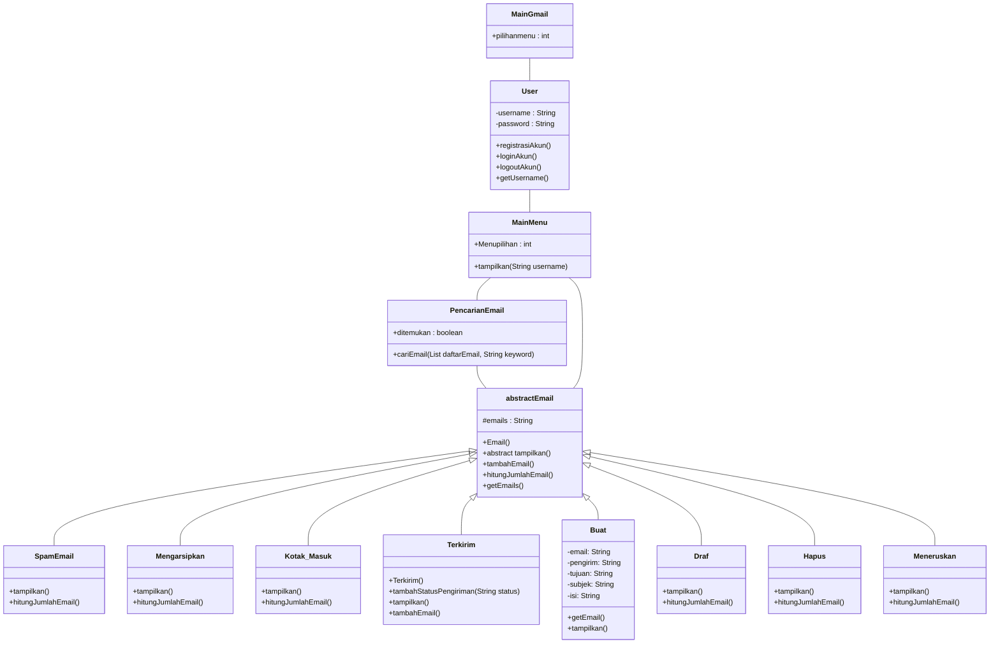


- Keterangan 
    - Class Diagram Menggunakan Mermaid.js
    - Setiap kelas miliki hubungan antar kelas, seperti kelas "MainGmail", "User","MainMenu","PencarianEmail","abstract Email" memiliki hubungan asosiasi yaitu sebagai hubungan antara dua class yang bersifat statis.
    - Pada kelas "Kotak_Masuk", "Terkirim", "Buat", "Draf", "abstrack Email", dll. memiliiki hubungan pewarisan yaitu kemampuan untuk mewarisi seluruh atribut dan metode dari kelas induk (superclass) ke anak kelas (subclass).
    - Pada Setiap Kelas bisa terdapat atribut maupun method. Untuk method memiliki ciri dengan menggunakan "()".
    - Simbol "+" = Public, Simbol "-" = Private, Simbol "#" = Protected
      
      
# 9. Mampu memberikan gambaran umum aplikasi kepada publik menggunakan presentasi berbasis video. (Lampirkan link Youtube terkait)

> [Link Youtube](https://youtu.be/UjzobDczDrM)

# 10. Inovasi UX. (Lampirkan url screenshot aplikasi di Gitlab / Github)

1. Menu Utama 

    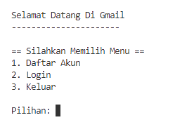

2. Menu Registrasi

    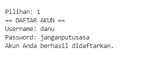

3. Menu Login

    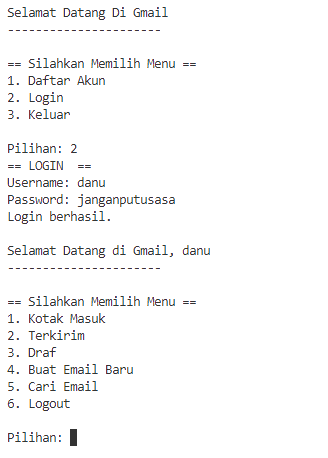

4. Menu Buat Email

    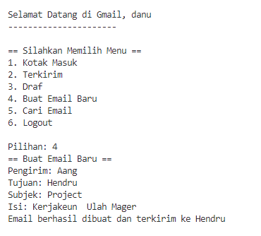

5. Menu Kotak Masuk

    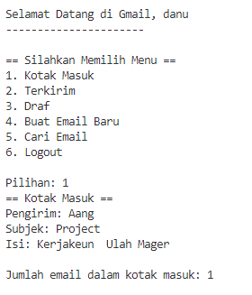

6. Menu Terkirim

    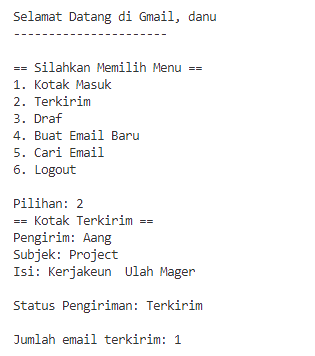

7. Menu Draf

    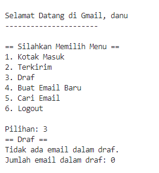

8. Menu Cari Email

    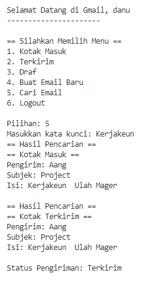

9. Menu Logout

    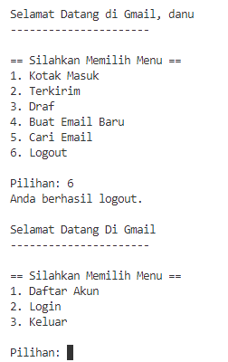

10. Menu Keluar

    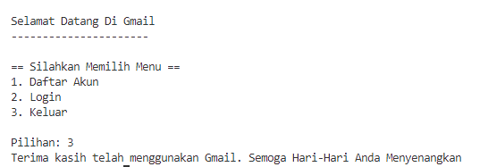
